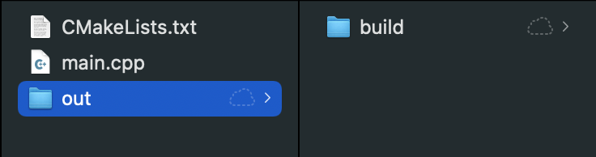

# CMake Cheat Sheet

This document is a cheat sheet I created for myself but perhaps it will be useful to others. I will continue to work on it as I learn more about CMake. If you see mistakes or have suggestions, please feel free to contact me at masood@masoodkamandy.com.

## Getting Started

CMake generates a makefile which specifies how your project will be linked and compiled.

A good practice is to create a build folder or an out and a build folder.

Create a C++ project with the following folder structure:



The `CMakeLists.txt` file is empty. This is a ***case sensitive file name***, so make sure you don't change the case at all.

The main.cpp file is just a minimal C++ main file:

```c++
#include <iostream>

int main()
{
    std::cout << "Hello World!\n";
    return 0;
}
```

CMake is basically a makefile compiler. In order to do your first build, you'll need to navigate to your `project/out/build` folder.

From your project folder type:

```bash
cd out/build/
```

Here we'll start our first barebones CMake build.

```bash
cmake -S ../../ -B .
```

`-S` is the location of your `CMakeLists.txt` file. `-B` is the build directory. `.` means just do it in the current directory.

At this point Cmake will 'compile' your `Makefile` and all of the files it needs to function.

You'll see the following in your `build` directory:

- `CMakeCache.txt`
- `CMakeFiles/`
- `Makefile`
- `cmake_install.cmake`

## Editing CMakeLists.txt: Beginning Steps

First, it's important to know that CMakeLists.txt files are written in CMake Language, which has its own syntax. Here's [a link to the reference](https://cmake.org/cmake/help/latest/manual/cmake-language.7.html).

First go to the terminal and check what version of CMake you have installed. Type:

```bash
cmake --version
```

Make note of whatever version you have and head over to your `CMakeLists.txt` file. At the top of this file type this with your version number. As long as you aren't going for backward compatibility, you can use whatever version you currently have.

```cmake
cmake_minimum_required(VERSION 3.20)
```

Next configure your **project title **(sub in whatever you'd like for `Title`):

```cmake
project(Title)
```

Next we're going to specify what the executable will be called using the project title we created above and what .cpp file to use. Type:

```cmake
add_executable(${PROJECT_NAME} main.cpp)
```

The `$` operator specifies veriable names. `${PROJECT_NAME}` is a variable which refers to the project name we set using the `project()` command above. `main.cpp` is the name of your main C++ file that you'd like to compile.

If you want to include more files when compiling, you can specify the files after main.cpp. For example, imagine we have a `common.cpp` file and its header `common.h` with a bunch of our most commonly used functions in it, we might type the following:

```cmake
add_executable(${PROJECT_NAME} main.cpp common.h common.cpp)
```

## Editing CMakeLists.txt: Adding Libraries Using Levels

Here we're going to create our own library with its own `CMakeLists.txt` file.

`CMakeLists.txt` can have **different levels**. If you are creating a library, your library should be in a subdirectory with its own `CMakeLists.txt` file.

Here's how the directory might look:


The most simple version of this file will only have the following in it:

```cmake
add_library(library library.cpp)
```

Back in your main `CMakeLists.txt` file, let's **create a reference to this new library**.

Instead of adding our source files to the `add_executable()` command above, we've turned our `common.h` and `common.cpp` into a library. So we can remove the references to them and go back to:

```cmake
add_executable(${PROJECT_NAME} main.cpp)
```

Below this, we'll need to do 3 things:

1. Add a subdirectory.
2. Declare our include directories.
3. And link our library.

We do this with the following code:

```cmake
add_subdirectory(library)

## This enables you to include your library without the path to the library.*
target_include_directories(${PROJECT_NAME} PUBLIC library)

## Link library to project.*
target_link_libraries(${PROJECT_NAME} library)
```

The PUBLIC keyword is about scope, but is beyond my knowledge at this moment, but [here is a good resource explaining this](https://stackoverflow.com/questions/26243169/cmake-target-include-directories-meaning-of-scope). Another resource with [a slightly more clear explanation](https://stackoverflow.com/questions/26037954/cmake-target-link-libraries-interface-dependencies).

## Editing CMakeLists.txt: Submodules and GitHub Integration

CMake allows you to include any GitHub repo into your project fairly seamlessly by submoduling it in.

This is used with a git command which has the following syntax:

`git submodule add <remote-repo> <destination-directory>`

In this example let's add [GLFW](https://github.com/glfw/glfw) (a windowing library for computer graphics) to our project. In order to use git submodules in our project, the project has to be a git repository, so first initialize your project as a git repository.

For more information on git commands, you can [use my cheat sheet](https://github.com/masoodkamandy/git-cheat-sheet).

Once you've initialized your git repo, you can add submodules by copying the URL to the repo here:


We're going to put our dependencies into a folder called `external`. With this repo, the command would look like this:

```bash
git submodule add https://github.com/glfw/glfw.git external/glfw
```

After you've added the submodule, **stage your changes and commit**. If you don't stage them, it will not work.

Then you can add the subdirectory to your `CMakeLists.txt` file in the same area that you've added other subdirectories:

```cmake
add_subdirectory(external/glfw)
```

You'll also need to **specify your include directory**. Many libraries have an include directory and GLFW is one of those. This directory includes GLFW's **header files**.

You'll also need to **specify the directory of the library source files**, since they are in a different location. [*Note:* We didn't do this for our library because the header and source are in the same place, so it isn't necessary.]

Modifying our previous code we get:

```cmake
# This enables you to include your library without the path to the library. This is for header files.*
target_include_directories(${PROJECT_NAME} 
	PUBLIC library
	PUBLIC external/glfw/include
)

# This is for the actual source of your libraries, as opposed to header files.*
target_link_directories(${PROJECT_NAME}
	PRIVATE external/glfw/src
)
```

Next we need to add a reference to the compiled library that CMake created when it ran. You can see the file here:


When a library includes its own `CMakeLists.txt` file, we refer to the library (and the compiled library file above) by using the name it gives itself in its CMakeLists.txt file with the ``add_library()` command. If we look at `external/glfw/src/CMakeLists.txt` we'll see the following at line 2:

```cmake
add_library(glfw
	"${GLFW_SOURCE_DIR}/include/GLFW/glfw3.h"
	"${GLFW_SOURCE_DIR}/include/GLFW/glfw3native.h"
	internal.h mappings.h context.c init.c input.c monitor.c vulkan.c window.c
)
```

You can see the library calls itself `glfw` so in our main CMakeLists.txt file we'll modify things to include it:

```cmake
# Link library to project.
target_link_libraries(${PROJECT_NAME}
	library
	glfw
)
```

Go ahead and build and it should work.

## Putting up a basic GLFW window to test

Since we used GLFW as our window, it might be fun to actually use the library and see what happens.

In this code, we'll create the most barebones example of a GLFW window and put it up on the screen.

```c++
#include <iostream>
#include "library.h"
#include <GLFW/glfw3.h>

int main()
{
    GLFWwindow *window;

    if (!glfwInit())
    {
        fprintf(stderr, "Failed to initialize GLFW\n");
        exit(EXIT_FAILURE);
    }

    window = glfwCreateWindow(300, 300, "MyProject", NULL, NULL);

    if (!window)
    {
        fprintf(stderr, "Failed to open GLFW window\n");
        glfwTerminate();
        exit(EXIT_FAILURE);
    }

    // Main Loop
    while (!glfwWindowShouldClose(window))
    {
        glfwPollEvents();
    }

    glfwTerminate();

    return 0;
}
```

### *A note on cloning this kind of repo*

Because we are using a git submodule, when people clone your project it will not download the submodules for you because they are not really considered to be a part of your repository. This needs to be done manually and can be done easily with the following command:

```bash
git submodule update --init --recursive
```

There is a method for doing this automatically in your `CMakeLists.txt` file, but it's beyond the scope of this article. You can find [a great description of how to do this at this link](https://cliutils.gitlab.io/modern-cmake/chapters/projects/submodule.html).

## Editing CMakeLists.txt: Versions

If you want to keep track of your versions, you can add a version argument to your `project()` command in your `CMakeLists.txt` file. This section will teach you how to print a version number whenever your program starts up.

 To do this, we first have to modify our project() command to the following (`MyProject` and version number can, of course, be anything you'd like):

```cmake
project(MyProject VERSION 1.0)
```

We can also specify the C++ standard we'd like to use with the following:

```cmake
# specify the C++ standard
set(CMAKE_CXX_STANDARD 11)
set(CMAKE_CXX_STANDARD_REQUIRED True)
```

We're going to have CMake **generate a header file** that defines the version number at compile time.

To do that, you can add this line:

```cmake
configure_file(Config.h.in Config.h)
```

`Config.h.in` is where we create a macro definition that CMake can read and use to generate the `Config.h` file, which is created by CMake at compile time. It's how we can extract and print our version number.

We also need to create a new target_include_directories command so that we can `#include` our generated `Config.h` file. Below the `add_executable()` command, go ahead and add the following:

```cmake
target_include_directories(${PROJECT_NAME} PUBLIC ${PROJECT_BINARY_DIR})
```

Now create a new file called `Config.h.in` (or any name you please as long as it is consistent with the above instructions) and include the following:

```c++
#define MYPROJECT_VERSION_MAJOR "@MyProject_VERSION_MAJOR@"
#define MYPROJECT_VERSION_MINOR "@MyProject_VERSION_MINOR@"
```

Now in `main.cpp`, you can add the include:

```c++
#include <Config.h>
```

Now change the `main()` to include arguments and add a cout to tell us the version number (I added the carriage returns for clarity here, but they're not necesary):

```c++
*int* main(*int* *argc*, *char* ****argv*[])
{
  std::cout << argv[0] 
    				<< " Version "
    				<< MYPROJECT_VERSION_MAJOR
    				<< "." 
    				<< MYPROJECT_VERSION_MINOR
    				<< '\n';
```

`argv[0]` just prints out your program's name and the macro definitions were generated for you at compile time by CMake. Your output should look like this:

```bash
./MyProject Version 1.0
```

## Acknowledgements

This document is basically me working through the excellent CMake tutorials by Code, Tech, and Tutorials on YouTube. [Here's a link to the CMake playlist](https://www.youtube.com/watch?v=nlKcXPUJGwA&list=PLalVdRk2RC6o5GHu618ARWh0VO0bFlif4&t=0s). Videos 1–4 were the most relevant to me at the moment, so those were what I focussed on.

I've aslo drawn from the [CMake tutorial on cmake.org](https://cmake.org/cmake-tutorial/).

